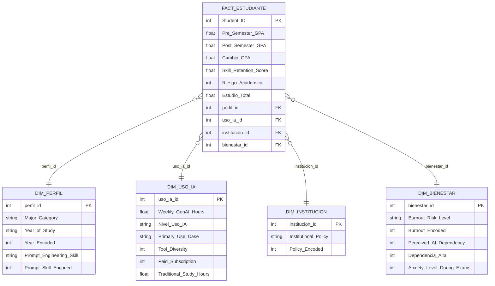

[](https://www.python.org/)
[](https://pandas.pydata.org/)
[](https://numpy.org/)
[](https://scikit-learn.org/)
[](https://jupyter.org/)
[](https://powerbi.microsoft.com/)
[](https://matplotlib.org/)
[](https://seaborn.pydata.org/)
[](https://www.kaggle.com/datasets/laveshjadon/ai-impact-on-students)

# Proyecto de analítica de datos y modelo predictivo sobre el impacto de la IA generativa en estudiantes universitarios

Análisis del comportamiento académico estudiantil en relación con el uso de IA generativa, aplicando un flujo ETL → EDA → BI → modelos predictivos supervisados.

---

## Dataset

**Nombre:** Impact of IA on Students  
**Link:** https://www.kaggle.com/datasets/laveshjadon/ai-impact-on-students  
**Registros:** 50,000 estudiantes universitarios  
**Variables:** 16 columnas originales + 5 variables derivadas tras transformación  
**Fuente:** Kaggle

---

## Diccionario de variables

| Campo | Descripción | Tipo |
|---|---|---|
| Student_ID | Identificador único del estudiante | Numérica |
| Major_Category | Área de estudio: STEM, Business, Humanities, Medical, Arts | Categórica |
| Year_of_Study | Nivel académico: Freshman, Sophomore, Junior, Senior, Graduate | Categórica ordinal |
| Pre_Semester_GPA | Promedio académico al inicio del semestre | Numérica (1.0–4.0) |
| Weekly_GenAI_Hours | Horas semanales de uso de IA generativa | Numérica (0–40) |
| Primary_Use_Case | Uso principal: Debugging/Troubleshooting, Copywriting/Drafting, Ideation, Summarizing_Reading, Direct_Answer_Generation | Categórica |
| Prompt_Engineering_Skill | Nivel de habilidad para formular prompts: Beginner, Intermediate, Advanced | Categórica ordinal |
| Tool_Diversity | Número de herramientas de IA distintas utilizadas (1–5) | Numérica |
| Paid_Subscription | Suscripción de pago a herramientas de IA (True / False) | Binaria |
| Traditional_Study_Hours | Horas semanales de estudio tradicional | Numérica |
| Perceived_AI_Dependency | Dependencia percibida de la IA, escala 1–10 | Numérica |
| Institutional_Policy | Política institucional: Strict_Ban, Allowed_With_Citation, Actively_Encouraged | Categórica ordinal |
| Anxiety_Level_During_Exams | Nivel de ansiedad durante exámenes, escala 1–10 | Numérica |
| Post_Semester_GPA | Promedio académico al final del semestre | Numérica (1.0–4.0) |
| Skill_Retention_Score | Puntaje de retención de habilidades adquiridas (0–100) | Numérica |
| Burnout_Risk_Level | Nivel de riesgo de burnout: Low, Medium, High | Categórica ordinal |

### Variables derivadas (creadas en la fase ETL)

| Variable | Descripción |
|---|---|
| Cambio_GPA | Post_Semester_GPA − Pre_Semester_GPA |
| Nivel_Uso_IA | Bajo (<5h/sem), Medio (5–15h/sem), Alto (>15h/sem) |
| Dependencia_Alta | 1 si Perceived_AI_Dependency ≥ 7, 0 en caso contrario |
| Estudio_Total | Traditional_Study_Hours + Weekly_GenAI_Hours |
| Riesgo_Academico | 1 si Post_GPA < 2.5 o Cambio_GPA < −0.3 — variable objetivo de clasificación |

---

## Integrantes - Grupo 5

| Nombre               | Fase principal |
|----------------------|----------------|
| Ziuvar Ruiz          | Fase 3         |
| Vanessa Alfaro       | Fases 1 y 2    |
| Juan Manuel Valencia | Fases 4 y 5    |
| Juan Cardona         | Fases 4 y 5    |

---

## Objetivos

Construir un proyecto integral de analítica de datos que permita comprender el impacto de la IA generativa en el entorno universitario, cubriendo:

- Limpiar y transformar el dataset crudo en una base confiable para el análisis.
- Explorar visualmente los patrones de uso de IA y su relación con el rendimiento académico, la dependencia tecnológica, la retención de habilidades y el burnout estudiantil.
- Entrenar modelos de regresión para predecir el cambio en GPA y modelos de clasificación para identificar estudiantes con riesgo académico.
- Producir conclusiones y recomendaciones basadas en evidencia defendibles en un entorno académico.

---

## Tecnologías utilizadas

| Componente | Tecnología |
|---|---|
| Lenguaje | Python 3.11 |
| Manipulación de datos | pandas, numpy |
| Visualización | matplotlib, seaborn |
| Machine Learning | scikit-learn |
| Business Intelligence | Power BI |
| Notebooks | Jupyter Notebook |
| Persistencia | CSV, JSON, PBIX |

---

## Arquitectura del proyecto

```
AI_Impact_Students/
│
├── data/
│   ├── raw/
│   │   └── ai_student_impact.csv          # Dataset original (50,000 registros, 16 columnas)
│   ├── cleaned/
│   │   └── students_cleaned.csv           # Dataset limpio sin variables derivadas
│   ├── processed/
│   │   └── students_model_ready.csv       # Dataset con variables derivadas y encodings
│   └── bi/
│       ├── FACT_ESTUDIANTE.csv            # Tabla de hechos del esquema estrella
│       ├── DIM_PERFIL.csv                 # Dimensión de perfil académico
│       ├── DIM_USO_IA.csv                 # Dimensión de hábitos de uso de IA
│       ├── DIM_INSTITUCION.csv            # Dimensión de política institucional
│       ├── DIM_BIENESTAR.csv              # Dimensión de bienestar y dependencia
│       └── bi_kpis.json                   # KPIs y agregados del dashboard
│
├── notebooks/
│   ├── 01_etl.ipynb                       # ETL: limpieza, transformación y exportación
│   ├── 02_eda.ipynb                       # EDA: análisis exploratorio y visualizaciones
│   └── 03_bi.ipynb                        # BI: modelo dimensional, KPIs y visualizaciones
│
├── powerbi/
│   └── DASHBOARD ZIUVAR.pbix              # Dashboard interactivo de la fase 3
│
├── reports/
│   ├── *.png                              # Gráficas de EDA y modelado
│   ├── Fase3_BI_Informe.docx              # Informe formal de la fase 3
│   └── bi/                                # Gráficas y KPIs visuales del dashboard
│
├── requirements.txt
├── README.md
└── .gitignore
```

---

## Fase 1 - ETL: Extracción, Transformación y Carga

El dataset no presentó valores nulos ni registros duplicados, por lo que el trabajo se concentró en la transformación de tipos, el encoding de variables ordinales y la construcción de las cinco variables derivadas (ver diccionario).

Se aplicó encoding ordinal a:

- `Year_of_Study`: Freshman=1 / Sophomore=2 / Junior=3 / Senior=4 / Graduate=5
- `Prompt_Engineering_Skill`: Beginner=1 / Intermediate=2 / Advanced=3
- `Institutional_Policy`: Strict_Ban=0 / Allowed_With_Citation=1 / Actively_Encouraged=2
- `Burnout_Risk_Level`: Low=0 / Medium=1 / High=2

Para `Major_Category` y `Primary_Use_Case` el one-hot encoding se reservó para el notebook de modelado.

**Resultado:** `students_cleaned.csv` (50,000 filas, 16 columnas) y `students_model_ready.csv` (50,000 filas, 26 columnas).

---

## Fase 2 - EDA: Análisis Exploratorio de Datos

Se realizó una exploración en 14 secciones sobre el dataset procesado, cubriendo distribuciones de uso de IA y GPA, cambios por nivel de uso, correlación entre burnout y horas de IA, impacto de la dependencia sobre la retención, efecto de la habilidad de prompting, comportamiento por carrera y año de estudio, impacto de la política institucional y mapa de correlaciones entre variables numéricas.

### Hallazgos principales

- Los estudiantes con burnout High usan en promedio 15.2h semanales de IA, frente a 4.6h del grupo Low (ratio 3.3×).
- La dependencia percibida tiene una relación negativa con la retención de habilidades: de 76.0 puntos en dependencia=1 a 63.5 en dependencia=10 (−12.5 pts).
- El uso Medio (5–15h/sem) muestra el mayor cambio promedio de GPA (+0.23), por encima del uso Alto (+0.17), introduciendo el concepto de punto óptimo de uso.
- Los estudiantes Advanced en prompting mejoran su GPA 0.063 puntos más que los Beginner (+0.248 vs +0.185).
- Las instituciones con Strict_Ban no muestran diferencias significativas en horas de uso respecto a las permisivas, apuntando a la necesidad de estrategias formativas en lugar de regulatorias.

---

## Fase 3 - Inteligencia de Negocios: Modelo de datos y KPIs

### Modelo dimensional — Esquema Estrella

| Tabla | Tipo | Filas | Descripción |
|---|---|---|---|
| FACT_ESTUDIANTE | Hechos | 50,000 | Un registro por estudiante con todas las métricas del semestre |
| DIM_PERFIL | Dimensión | 50,000 | Carrera, año de estudio, nivel de habilidad de prompting |
| DIM_USO_IA | Dimensión | 50,000 | Horas semanales, caso de uso, diversidad de herramientas, suscripción |
| DIM_INSTITUCION | Dimensión | 3 | Tipo de política institucional frente al uso de IA |
| DIM_BIENESTAR | Dimensión | 50,000 | Nivel de burnout, ansiedad, dependencia percibida |

**Métricas de la tabla de hechos:** Pre_Semester_GPA, Post_Semester_GPA, Cambio_GPA, Skill_Retention_Score, Riesgo_Academico, Estudio_Total.



### Reglas de negocio

| Regla | Descripción |
|---|---|
| RN-01 | Un registro por estudiante por semestre, sin duplicados |
| RN-02 | Cambio_GPA = Post_Semester_GPA − Pre_Semester_GPA |
| RN-03 | Riesgo_Academico = 1 si Post_GPA < 2.5 o Cambio_GPA < −0.3 |
| RN-04 | Dependencia_Alta = 1 si Perceived_AI_Dependency ≥ 7 |
| RN-05 | Nivel_Uso_IA: Bajo < 5h / Medio 5–15h / Alto > 15h |
| RN-06 | La métrica principal de impacto académico es Cambio_GPA; la de bienestar es Skill_Retention_Score |

### KPIs ejecutivos

| KPI | Valor |
|---|---|
| Horas semanales de IA — promedio / mediana | 8.43h / 5.8h |
| Horas de estudio tradicional — promedio | 11.21h |
| GPA promedio inicio / fin de semestre | 3.15 / 3.35 |
| Cambio promedio en GPA | +0.20 puntos |
| Retención de habilidades — promedio | 75.8 / 100 |
| Estudiantes con dependencia alta (≥ 7) | 6.3% — 3,150 |
| Estudiantes en riesgo académico | 6.8% — 3,412 |
| Estudiantes con uso alto de IA (>15h/sem) | 17.1% — 8,542 |
| Estudiantes con suscripción de pago | 42.3% |
| Horas de IA — burnout High vs Low | 15.2h vs 4.6h (ratio: 3.3×) |
| Retención — dependencia 1 vs dependencia 10 | 76.0 vs 63.5 (−12.5 pts) |
| Cambio GPA — Advanced vs Beginner en prompting | +0.248 vs +0.185 (+0.063) |
| Cambio GPA — uso Medio vs Alto | +0.227 vs +0.173 |
| Carrera con mayor retención promedio | STEM — 76.8 / 100 |
| Nivel de uso de IA más frecuente | Bajo — 45.1% (22,567) |
| Burnout más frecuente | Medium — 42.3% (21,144) |
| Política institucional más frecuente | Allowed_With_Citation — 50.4% |

---

## Fase 4 - Modelado Predictivo

Se entrenaron siete modelos en total: tres de regresión para predecir el Cambio_GPA y cuatro de clasificación para predecir el Riesgo_Academico. Se usó validación cruzada de 5 folds (10,000 estudiantes por fold), análisis de importancia de variables y matrices de confusión.

### Regresión - predicción del Cambio_GPA

Variable objetivo continua. Se excluyeron `Post_Semester_GPA` y `Riesgo_Academico` para evitar fuga de información.

| Modelo | RMSE | MAE | R² |
|---|---|---|---|
| Regresión Lineal | 0.1565 | 0.1231 | 0.2870 |
| Árbol de Decisión | 0.1530 | 0.1193 | 0.3187 |
| **Random Forest** | **0.1440** | **0.1132** | **0.3967** |

Random Forest fue el mejor modelo. La validación cruzada produjo un R² promedio de 0.3884 (σ=0.0067), lo que confirma estabilidad. El R² moderado es esperable dado que el rendimiento académico depende de factores externos no registrados en el dataset (motivación, situación económica, dificultad de las asignaturas, etc.).

**Variables más importantes:** `Traditional_Study_Hours` > `Year_Encoded` > `Weekly_GenAI_Hours` > `Pre_Semester_GPA` > `Prompt_Skill_Encoded`.

### Clasificación - predicción del Riesgo_Academico

Variable objetivo binaria con desbalance de clases (6.8% positivo). Se usó `class_weight='balanced'` y se priorizaron F1-Score y AUC-ROC sobre accuracy. Se excluyeron `Post_Semester_GPA` y `Cambio_GPA` para evitar data leakage.

| Modelo | Accuracy | F1-Score | AUC-ROC |
|---|---|---|---|
| Regresión Logística | 89.08% | 0.5389 | 0.9659 |
| Árbol de Decisión | 92.14% | 0.6173 | 0.9604 |
| Random Forest | 93.76% | 0.6705 | 0.9771 |
| **Gradient Boosting** | **96.93%** | **0.7665** | **0.9822** |

Gradient Boosting fue el mejor modelo. La validación cruzada mostró un F1 promedio de 0.7660 (σ=0.0046), indicando alta consistencia.

**Matriz de confusión — Gradient Boosting (sobre fold de test):**
- Verdaderos negativos: 9,189 | Verdaderos positivos: 504
- Falsos positivos: 129 | Falsos negativos: 178

En contexto educativo, los falsos negativos son el error más costoso (estudiantes en riesgo no detectados). El número obtenido es bajo respecto al total evaluado.

**Variables más importantes:** `Pre_Semester_GPA` > `Skill_Retention_Score` > `Weekly_GenAI_Hours` > `Traditional_Study_Hours` > `Perceived_AI_Dependency`.

---

## Conclusiones

Random Forest obtuvo el mejor desempeño en la predicción del Cambio_GPA y Gradient Boosting en la identificación de estudiantes con Riesgo_Academico. Ambos modelos demostraron estabilidad mediante validación cruzada.

El estudio tradicional sigue siendo el principal determinante del rendimiento académico, pero el uso de IA tiene una influencia medible. El nivel de uso óptimo es moderado (5–15h/sem): el uso excesivo muestra rendimientos decrecientes. La habilidad de prompting y la dependencia percibida son los factores relacionados con IA que más impactan los resultados, lo que sugiere que la formación en uso efectivo importa más que el volumen de horas.

Las instituciones obtendrían mayores beneficios promoviendo el uso reflexivo y crítico de la IA en lugar de enfocarse en restricciones, dado que las políticas de prohibición no muestran diferencia estadística en los niveles de uso observados.

> **Nota metodológica:** El dataset proviene de Kaggle y fue diseñado para fines académicos. Los resultados representan patrones observados dentro de este conjunto de datos y no son generalizables a la totalidad de la población universitaria, ni establecen relaciones causales definitivas.
