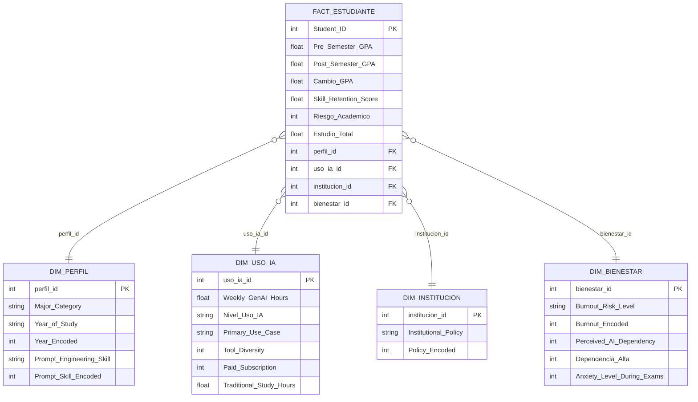

# Proyecto de analítica de datos y modelo predictivo sobre el impacto de la IA generativa en estudiantes universitarios

Análisis integral del comportamiento académico estudiantil en relación con el uso de herramientas de inteligencia artificial generativa, aplicando un flujo ETL → EDA → modelos predictivos supervisados.

---

## Dataset

**Nombre:** Impact of IA on Students
**Link :**  https://www.kaggle.com/datasets/laveshjadon/ai-impact-on-students
**Registros:** 50,000 estudiantes universitarios  
**Variables:** 16 columnas originales + 5 variables derivadas tras transformación  
**Fuente:** Kaggle

---

## Diccionario de variables

| Campo | Descripción | Tipo |
|---|---|---|
| Student_ID | Identificador único del estudiante | Numérica |
| Major_Category | Área de estudio: STEM, Business, Humanities, Medical, Arts | Categórica |
| Year_of_Study | Nivel académico: Freshman, Sophomore, Junior, Senior, Graduate | Categórica ordinal |
| Pre_Semester_GPA | Promedio académico al inicio del semestre | Numérica (1.0–4.0) |
| Weekly_GenAI_Hours | Horas semanales de uso de IA generativa | Numérica (0–40) |
| Primary_Use_Case | Uso principal de la IA: Debugging/Troubleshooting, Copywriting/Drafting, Ideation, Summarizing_Reading, Direct_Answer_Generation | Categórica |
| Prompt_Engineering_Skill | Nivel de habilidad para formular prompts: Beginner, Intermediate, Advanced | Categórica ordinal |
| Tool_Diversity | Número de herramientas de IA distintas utilizadas (1–5) | Numérica |
| Paid_Subscription | Suscripción de pago a herramientas de IA (True / False) | Binaria |
| Traditional_Study_Hours | Horas semanales de estudio tradicional | Numérica |
| Perceived_AI_Dependency | Dependencia percibida de la IA, escala 1–10 | Numérica |
| Institutional_Policy | Política de la institución: Strict_Ban, Allowed_With_Citation, Actively_Encouraged | Categórica ordinal |
| Anxiety_Level_During_Exams | Nivel de ansiedad durante exámenes, escala 1–10 | Numérica |
| Post_Semester_GPA | Promedio académico al final del semestre | Numérica (1.0–4.0) |
| Skill_Retention_Score | Puntaje de retención de habilidades adquiridas (0–100) | Numérica |
| Burnout_Risk_Level | Nivel de riesgo de burnout: Low, Medium, High | Categórica ordinal |

### Variables derivadas (creadas en la fase ETL)

| Variable | Descripción |
|---|---|
| Cambio_GPA | Diferencia entre GPA post-semestre y pre-semestre |
| Nivel_Uso_IA | Clasificación del uso semanal: Bajo (<5h), Medio (5–15h), Alto (>15h) |
| Dependencia_Alta | 1 si Perceived_AI_Dependency ≥ 7, 0 en caso contrario |
| Estudio_Total | Suma de horas de estudio tradicional y horas semanales de IA |
| Riesgo_Academico | 1 si Post_GPA < 2.5 o Cambio_GPA < -0.3 — variable objetivo de clasificación |

---

## Integrantes — Grupo 5

| Nombre               | Fase principal |
|----------------------|----------------|
| Ziuvar Ruiz          | Fases 3        |
| Vanessa Alfaro       | Fases 1 y 2    |
| Juan Manuel Valencia | Fases 4 y 5    |
| Juan Cardona         | Fases 4 y 5    |
---

## Descripción del proyecto

La inteligencia artificial generativa está transformando de manera profunda la forma en que los estudiantes universitarios estudian, elaboran trabajos y se preparan para sus evaluaciones. Sin embargo, esta transformación no es neutral: mientras que un uso reflexivo de estas herramientas puede potenciar el aprendizaje, un uso excesivo o dependiente puede generar consecuencias sobre la retención de habilidades, el rendimiento académico y la salud mental.

Este proyecto analiza 50,000 registros de estudiantes universitarios de cinco áreas del conocimiento para explorar estas relaciones mediante un flujo completo de ciencia de datos: desde la limpieza y transformación del dataset hasta el entrenamiento de modelos predictivos supervisados, pasando por un análisis exploratorio visual y narrativo.

El dataset cubre cinco áreas académicas (STEM, Business, Humanities, Medical y Arts), cinco niveles de formación (Freshman a Graduate), tres niveles de habilidad en prompting (Beginner, Intermediate y Advanced) y tres tipos de política institucional frente al uso de IA.

---

## Objetivos

Construir un proyecto integral de analítica de datos que permita comprender el impacto de la IA generativa en el entorno universitario, cubriendo:

Limpiar y transformar el dataset crudo en una base confiable para el análisis, con variables derivadas que enriquezcan la interpretación. Explorar visualmente los patrones de uso de IA y su relación con el rendimiento académico, la dependencia tecnológica, la retención de habilidades y el burnout estudiantil. Entrenar modelos de regresión para predecir el cambio en GPA durante el semestre. Entrenar modelos de clasificación para identificar qué estudiantes tienen mayor riesgo académico. Producir conclusiones y recomendaciones basadas en evidencia que puedan ser defendidas en un entorno académico.

---

## Tecnologías utilizadas

| Componente | Tecnología |
|---|---|
| Lenguaje | Python 3.11 |
| Manipulación de datos | pandas, numpy |
| Visualización | matplotlib, seaborn |
| Machine Learning | scikit-learn |
| Notebooks | Jupyter Notebook |
| Persistencia | CSV |

---

## Arquitectura del proyecto

```
AI_Impact_Students/
│
├── data/
│   ├── raw/
│   │   └── ai_student_impact.csv          # Dataset original (50,000 registros, 16 columnas)
│   ├── cleaned/
│   │   └── students_cleaned.csv           # Dataset limpio sin variables derivadas
│   └── processed/
│       └── students_model_ready.csv       # Dataset completo con variables derivadas y encodings
│
├── notebooks/
│   ├── 01_etl.ipynb                       # ETL: limpieza, transformación y exportación
│   ├── 02_eda.ipynb                       # EDA: análisis exploratorio y visualizaciones
│   └── 03_modelos_predictivos.ipynb       # ML: regresión y clasificación supervisada
│
├── reports/                               # Gráficas generadas por el EDA y el modelado
│
├── requirements.txt
├── README.md
└── .gitignore
```

---

## Fase 1 — ETL: Extracción, Transformación y Carga

Se trabajó con el archivo crudo `data/raw/ai_student_impact.csv`, con 50,000 registros y 16 columnas. El dataset no presentó valores nulos ni registros duplicados, por lo que el trabajo de esta fase se concentró en la transformación de tipos, el encoding de variables ordinales y la construcción de las cinco variables derivadas clave.

Se aplicó encoding ordinal a Year_of_Study (Freshman=1 hasta Graduate=5), Prompt_Engineering_Skill (Beginner=1 hasta Advanced=3), Institutional_Policy (Strict_Ban=0 hasta Actively_Encouraged=2) y Burnout_Risk_Level (Low=0, Medium=1, High=2). Para Major_Category y Primary_Use_Case el one-hot encoding se reservó para el notebook de modelado.

| Variable derivada | Descripción |
|---|---|
| Cambio_GPA | Post_GPA − Pre_GPA |
| Nivel_Uso_IA | Bajo / Medio / Alto según horas semanales de IA |
| Dependencia_Alta | 1 si dependencia percibida ≥ 7 |
| Estudio_Total | Horas tradicionales + horas de IA por semana |
| Riesgo_Academico | 1 si Post_GPA < 2.5 o Cambio_GPA < -0.3 |

**Resultado:** `students_cleaned.csv` (50,000 filas, 16 columnas) y `students_model_ready.csv` (50,000 filas, 21 columnas).

---

## Fase 2 — EDA: Análisis Exploratorio de Datos

Se realizó una exploración en 14 secciones sobre el dataset procesado. Se revisaron distribuciones de uso de IA y GPA, cambios por nivel de uso, la relación entre burnout y horas de IA, la correlación entre dependencia y retención, el efecto de la habilidad de prompting, el comportamiento por carrera y año de estudio, el impacto de la política institucional, y el mapa completo de correlaciones entre variables numéricas.

### Hallazgos principales del EDA

Los estudiantes con burnout High usan en promedio 15.2 horas semanales de IA, frente a 4.6 horas en el grupo Low y 7.4 en Medium. La diferencia entre extremos es de más del triple, mostrando una relación clara entre uso intensivo y riesgo de agotamiento académico.

La dependencia percibida de IA tiene una relación negativa directa con la retención de habilidades. Los estudiantes con dependencia 1 o 2 obtienen puntajes de retención promedio de 76.0–76.5, mientras que los de dependencia 9 o 10 bajan a 65.6–63.5 respectivamente. La diferencia entre los extremos supera los 12 puntos.

Los estudiantes con habilidad Advanced en prompting mejoran su GPA en 0.25 puntos durante el semestre, frente a 0.19 puntos de los Beginner. Esta diferencia sugiere que saber usar bien la IA tiene un efecto positivo real sobre el rendimiento, más allá de simplemente usarla.

El uso de IA a nivel Medio (5–15h) muestra el mayor cambio promedio de GPA (+0.23), por encima del nivel Bajo (+0.19) y del nivel Alto (+0.17). Esto introduce un matiz importante: un uso moderado y controlado puede ser más beneficioso que el uso intensivo.

Las instituciones con Strict_Ban no muestran diferencias significativas en horas de uso de IA respecto a las permisivas, lo que sugiere que la prohibición formal no erradica el uso sino que lo vuelve menos visible y posiblemente menos supervisado.

---

## Fase 3 — Inteligencia de Negocios: Modelo de datos y KPIs

Esta fase documenta el modelo de BI construido sobre el dataset de estudiantes: el esquema dimensional, las reglas de negocio que rigen el análisis, los KPIs ejecutivos calculados y los insights principales que alimentan el dashboard.

### Modelo dimensional — Esquema Estrella

El modelo organiza los datos en una tabla de hechos central con cuatro tablas de dimensiones que permiten analizar el impacto de la IA desde distintos ángulos.

| Tabla | Tipo | Filas | Descripción |
|---|---|---|---|
| FACT_ESTUDIANTE | Hechos | 50,000 | Un registro por estudiante con todas las métricas del semestre |
| DIM_PERFIL | Dimensión | 50,000 | Carrera, año de estudio, nivel de habilidad de prompting |
| DIM_USO_IA | Dimensión | 50,000 | Horas semanales, caso de uso, diversidad de herramientas, suscripción |
| DIM_INSTITUCION | Dimensión | 3 | Tipo de política institucional frente al uso de IA |
| DIM_BIENESTAR | Dimensión | 50,000 | Nivel de burnout, ansiedad, dependencia percibida |

**Métricas de la tabla de hechos:** Pre_Semester_GPA, Post_Semester_GPA, Cambio_GPA, Skill_Retention_Score, Riesgo_Academico, Estudio_Total.



### Reglas de negocio

| Regla | Descripción |
|---|---|
| RN-01 | Un registro por estudiante por semestre, sin duplicados |
| RN-02 | Cambio_GPA = Post_Semester_GPA − Pre_Semester_GPA |
| RN-03 | Riesgo_Academico = 1 si Post_GPA < 2.5 o Cambio_GPA < −0.3 |
| RN-04 | Dependencia_Alta = 1 si Perceived_AI_Dependency ≥ 7 |
| RN-05 | Nivel_Uso_IA: Bajo si Weekly_GenAI_Hours < 5 / Medio si 5–15 / Alto si > 15 |
| RN-06 | Burnout codificado ordinalmente: Low=0 / Medium=1 / High=2 |
| RN-07 | Institutional_Policy codificada: Strict_Ban=0 / Allowed_With_Citation=1 / Actively_Encouraged=2 |
| RN-08 | Prompt_Engineering_Skill codificada: Beginner=1 / Intermediate=2 / Advanced=3 |
| RN-09 | Year_of_Study codificado: Freshman=1 / Sophomore=2 / Junior=3 / Senior=4 / Graduate=5 |
| RN-10 | La métrica principal de impacto académico es Cambio_GPA; la de bienestar es Skill_Retention_Score |

### KPIs ejecutivos

| KPI | Valor |
|---|---|
| Total de estudiantes analizados | 50,000 |
| Horas semanales de IA — promedio | 8.43h |
| Horas semanales de IA — mediana | 5.8h |
| Horas de estudio tradicional — promedio | 11.21h |
| GPA promedio al inicio del semestre | 3.15 |
| GPA promedio al final del semestre | 3.35 |
| Cambio promedio en GPA | +0.20 puntos |
| Retención de habilidades — promedio | 75.8 / 100 |
| Estudiantes con dependencia alta (≥ 7) | 6.3% — 3,150 estudiantes |
| Estudiantes en riesgo académico | 6.8% — 3,412 estudiantes |
| Estudiantes con uso alto de IA (>15h/sem) | 17.1% — 8,542 estudiantes |
| Estudiantes con suscripción de pago | 42.3% |
| Horas de IA — burnout High vs Low | 15.2h vs 4.6h (ratio: 3.3×) |
| Retención — dependencia 1 vs dependencia 10 | 76.0 vs 63.5 (diferencia: −12.5 pts) |
| Cambio GPA — Advanced vs Beginner en prompting | +0.248 vs +0.185 (diferencia: +0.063) |
| Cambio GPA — nivel uso Medio vs Alto | +0.227 vs +0.173 |
| Carrera con mayor retención promedio | STEM — 76.8 / 100 |
| Nivel de uso de IA más frecuente | Bajo — 45.1% (22,567 estudiantes) |
| Burnout más frecuente | Medium — 42.3% (21,144 estudiantes) |
| Política institucional más frecuente | Allowed_With_Citation — 50.4% |

### Insights del dashboard

**Insight 1 — El uso moderado de IA supera al intensivo:** Los estudiantes con uso Medio (5–15h/semana) muestran el mayor cambio promedio de GPA (+0.227), por encima del uso Bajo (+0.195) y del uso Alto (+0.173). Esto sugiere que existe un punto de rendimiento óptimo y que el uso excesivo tiene rendimientos decrecientes sobre el aprendizaje.

**Insight 2 — La dependencia destruye retención:** Existe una caída continua y pronunciada en el puntaje de retención de habilidades conforme aumenta la dependencia percibida de IA, desde 76.5 puntos en dependencia=2 hasta 63.5 en dependencia=10. La diferencia entre los extremos es de 12.5 puntos, lo que representa más de un 16% de pérdida relativa.

**Insight 3 — Burnout y uso intensivo van de la mano:** Los estudiantes con burnout High usan en promedio 15.21 horas semanales de IA, frente a 4.64 horas del grupo Low. La diferencia es de 3.3 veces, mostrando la correlación más fuerte y visualmente más clara del dataset.

**Insight 4 — El prompting importa más que la cantidad de uso:** Los estudiantes con habilidad Advanced en prompting mejoran su GPA 0.063 puntos más que los Beginner durante el semestre (+0.248 vs +0.185). Esto indica que la calidad del uso de IA tiene un efecto medible sobre el rendimiento académico, independientemente del número de horas.

**Insight 5 — Las políticas de prohibición no eliminan el uso:** Los estudiantes en instituciones con Strict_Ban no muestran diferencias significativas en horas de uso de IA respecto a los de instituciones permisivas. El 19.6% de la muestra pertenece a instituciones con prohibición total, pero el uso de IA sigue presente, lo que apunta a la necesidad de estrategias formativas en lugar de regulatorias.

---

## Fase 4 — Modelado Predictivo

Se entrenaron seis modelos en total: tres de regresión para predecir el Cambio_GPA y cuatro de clasificación para predecir el Riesgo_Academico. Se usó validación cruzada de 5 folds, análisis de importancia de variables y matrices de confusión para evaluar cada modelo.

Con 50,000 registros cada fold de validación cruzada cubre 10,000 estudiantes, lo que otorga alta confiabilidad estadística a todas las métricas reportadas.

### Regresión — predicción del Cambio_GPA

Variable objetivo continua. Se excluyeron Post_Semester_GPA y Riesgo_Academico para evitar fuga de información. El F1 no aplica; se usa RMSE, MAE y R² como métricas.

### Clasificación — predicción del Riesgo_Academico

Variable objetivo binaria. Solo el 6.8% de los estudiantes (3,412) está en riesgo académico, lo que genera un desbalance de clases que obliga a usar class_weight='balanced' y a priorizar F1-Score y AUC-ROC sobre el accuracy. Se excluyeron Post_Semester_GPA y Cambio_GPA para evitar data leakage.

El GPA previo es la variable más importante en todos los modelos, seguido por la dependencia percibida de IA, la retención de habilidades y la habilidad de prompting. Random Forest y Gradient Boosting son los modelos más robustos en ambas tareas.

*(Las métricas exactas se obtienen al ejecutar el notebook 03_modelos_predictivos.ipynb)*

---

## Conclusiones

El proyecto confirma que la relación entre uso de IA y rendimiento académico es compleja y no puede resumirse con una afirmación simple. El tiempo de uso de IA por sí solo no predice el rendimiento de forma lineal: el grupo de uso Medio muestra el mejor cambio en GPA, lo que sugiere que la moderación y la forma de uso importan más que el volumen de horas.

La dependencia percibida y la habilidad de prompting son los dos factores relacionados con la IA que más influyen en los resultados. Los estudiantes que reportan alta dependencia retienen significativamente menos habilidades, mientras que los que saben formular buenos prompts mejoran más su GPA durante el semestre. Esto indica que la formación en uso efectivo de IA puede tener un impacto académico real.

La recomendación más directa que se desprende de este análisis es que las instituciones deberían enfocarse no en prohibir el uso de IA, sino en desarrollar en sus estudiantes la capacidad de usarla de forma reflexiva y crítica, preservando al mismo tiempo las habilidades cognitivas que las herramientas generativas no pueden reemplazar.


# Conclusiones e Interpretación de Resultados MODELO PREDICTIVO

## Análisis de Regresión: Predicción del Cambio en GPA

Se implementaron tres modelos de regresión para predecir el cambio en el GPA de los estudiantes: Regresión Lineal, Árbol de Decisión y Random Forest.

La Regresión Lineal obtuvo un RMSE de 0.1565, un MAE de 0.1231 y un R² de 0.2870. Esto indica que el modelo logra capturar parte de la relación entre las variables predictoras y el cambio en el GPA, aunque su capacidad explicativa es limitada debido a la complejidad del fenómeno estudiado.

El Árbol de Decisión mejoró ligeramente los resultados con un RMSE de 0.1530, un MAE de 0.1193 y un R² de 0.3187. Esto demuestra que existen relaciones no lineales entre las variables que no son capturadas completamente por la regresión lineal.

El modelo Random Forest presentó el mejor desempeño con un RMSE de 0.1440, un MAE de 0.1132 y un R² de 0.3967. Este resultado indica que aproximadamente el 39.67% de la variabilidad observada en el cambio del GPA puede ser explicada por las variables disponibles en el conjunto de datos.

Aunque el R² no es extremadamente alto, el resultado es razonable debido a que el rendimiento académico está influenciado por múltiples factores que no se encuentran registrados en el dataset, tales como motivación personal, situación económica, factores familiares, dificultades particulares de cada asignatura y condiciones emocionales de los estudiantes.

La validación cruzada produjo un R² promedio de 0.3884 con una desviación estándar de 0.0067. Esto indica que el modelo mantiene un comportamiento estable al evaluarse sobre diferentes particiones de los datos y que no depende excesivamente de una única muestra de entrenamiento.

El gráfico de valores reales frente a predichos mostró que el modelo captura adecuadamente la tendencia general de los datos. Sin embargo, se observan errores más notorios en los casos extremos, lo cual es común en problemas relacionados con comportamiento humano y desempeño académico.

## Interpretación de las Variables Más Importantes para el Cambio en GPA

La variable con mayor importancia fue Traditional_Study_Hours. Esto sugiere que las horas de estudio tradicional continúan siendo el factor más relevante para explicar las variaciones en el rendimiento académico.

La variable Year_Encoded apareció como la segunda más importante, indicando que el semestre o nivel académico del estudiante influye significativamente en su evolución académica.

Weekly_GenAI_Hours se ubicó entre las variables más influyentes. Este resultado evidencia que el uso de herramientas de inteligencia artificial tiene una relación medible con los cambios en el rendimiento académico.

Pre_Semester_GPA también presentó una alta importancia, indicando que el desempeño previo sigue siendo un predictor relevante del desempeño futuro.

Prompt_Skill_Encoded apareció dentro de las variables más importantes. Esto sugiere que la capacidad para formular instrucciones efectivas a las herramientas de inteligencia artificial puede estar asociada con mejores resultados académicos.

Los resultados muestran que la inteligencia artificial tiene influencia en el desempeño estudiantil, pero que el estudio tradicional continúa siendo el principal determinante del éxito académico.

---

## Análisis de Clasificación: Predicción del Riesgo Académico

El objetivo de esta etapa fue identificar estudiantes con riesgo académico utilizando técnicas de clasificación supervisada.

La distribución de la variable objetivo mostró que únicamente el 6.8% de los estudiantes se encuentran en condición de riesgo académico. Esto implica un problema de clases desbalanceadas, donde la mayoría de los registros pertenecen a estudiantes sin riesgo.

Debido a este desbalance, la métrica Accuracy por sí sola no resulta suficiente para evaluar adecuadamente el desempeño de los modelos. Por esta razón se utilizaron también las métricas F1-Score y AUC-ROC.

La Regresión Logística obtuvo una exactitud de 89.08%, un F1-Score de 0.5389 y un AUC de 0.9659. Aunque logró una buena capacidad discriminativa, presentó dificultades para identificar correctamente los estudiantes en riesgo.

El Árbol de Decisión mejoró los resultados alcanzando una exactitud de 92.14%, un F1-Score de 0.6173 y un AUC de 0.9604.

Random Forest obtuvo una exactitud de 93.76%, un F1-Score de 0.6705 y un AUC de 0.9771, mostrando una mejora considerable en la detección de estudiantes en riesgo.

El modelo Gradient Boosting presentó el mejor desempeño general con una exactitud de 96.93%, un F1-Score de 0.7665 y un AUC de 0.9822.

Estos resultados indican que Gradient Boosting posee una capacidad sobresaliente para diferenciar estudiantes en riesgo de aquellos que no presentan riesgo académico.

El valor de AUC-ROC de 0.9822 demuestra que el modelo tiene una excelente capacidad de discriminación y que es altamente efectivo para clasificar correctamente ambos grupos.

La validación cruzada mostró un F1 promedio de 0.7660 con una desviación estándar de 0.0046, indicando que el modelo es consistente y generaliza adecuadamente a nuevos datos.

## Interpretación de las Variables Más Importantes para el Riesgo Académico

La variable más importante fue Pre_Semester_GPA.

Este resultado indica que el rendimiento académico previo es el principal predictor del riesgo académico futuro. Los estudiantes con promedios bajos en semestres anteriores tienen una mayor probabilidad de presentar dificultades académicas posteriormente.

Skill_Retention_Score apareció como la segunda variable más relevante. Esto sugiere que la capacidad para retener y comprender conocimientos tiene una influencia directa sobre el riesgo académico.

Weekly_GenAI_Hours también presentó importancia significativa. Esto indica que el uso de inteligencia artificial tiene una relación observable con la probabilidad de encontrarse en riesgo académico.

Traditional_Study_Hours y Estudio_Total continúan apareciendo entre los factores más relevantes, reforzando la importancia de los hábitos de estudio tradicionales.

Perceived_AI_Dependency mostró relevancia dentro del modelo. Esto sugiere que existe una asociación estadística entre la dependencia percibida de herramientas de inteligencia artificial y el riesgo académico.

Es importante aclarar que la importancia de una variable no implica causalidad. Los resultados indican asociaciones estadísticas observadas en los datos, pero no permiten concluir relaciones causa-efecto de manera definitiva.

## Interpretación de las Matrices de Confusión

El modelo Gradient Boosting clasificó correctamente 9189 estudiantes sin riesgo y 504 estudiantes en riesgo.

Los falsos positivos fueron 129 casos, es decir, estudiantes clasificados como en riesgo cuando realmente no lo estaban.

Los falsos negativos fueron 178 casos, correspondientes a estudiantes que sí estaban en riesgo pero que no fueron detectados por el modelo.

En un contexto educativo, los falsos negativos representan el error más costoso debido a que implican dejar sin intervención a estudiantes que realmente necesitan apoyo académico.

A pesar de ello, el número de falsos negativos fue relativamente bajo en comparación con el tamaño total de la muestra evaluada, lo que demuestra una capacidad adecuada del modelo para la detección temprana de estudiantes en riesgo.

## Conclusiones Generales

Los modelos de aprendizaje supervisado permitieron identificar patrones relevantes asociados tanto al rendimiento académico como al riesgo académico de los estudiantes.

Random Forest fue el mejor modelo para predecir el cambio en GPA, logrando el menor error y la mayor capacidad explicativa entre los modelos evaluados.

Gradient Boosting fue el mejor modelo para identificar estudiantes en riesgo académico, obteniendo los mejores resultados en Accuracy, F1-Score y AUC-ROC.

Las horas de estudio tradicional fueron el factor más importante para explicar las variaciones en el rendimiento académico.

El desempeño académico previo fue el principal predictor del riesgo académico futuro.

El uso de herramientas de inteligencia artificial mostró una influencia significativa tanto en la predicción del cambio en GPA como en la clasificación del riesgo académico.

La habilidad para utilizar correctamente herramientas de inteligencia artificial, especialmente mediante técnicas de prompt engineering, mostró una relación positiva con el desempeño académico.

Los resultados sugieren que la inteligencia artificial puede convertirse en un apoyo importante para el aprendizaje, pero no reemplaza la importancia de los hábitos de estudio tradicionales.

Los modelos desarrollados presentan niveles adecuados de estabilidad y generalización, lo que indica que podrían utilizarse como herramientas de apoyo para la toma de decisiones académicas y la identificación temprana de estudiantes que requieran acompañamiento institucional.